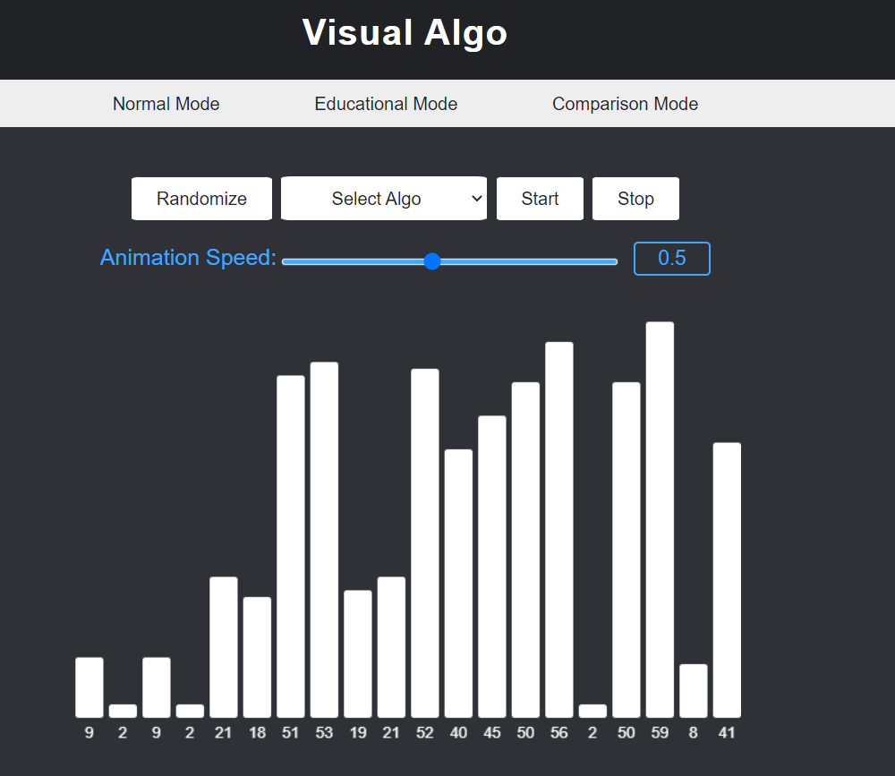

# Visual Algo

Visual Algo is a web application that visualizes popular algorithms step by step.
This application has three different modes available:

### Educational mode
This mode contains the definition of the algorithm and logs all the steps taken in the algorithm.

### Comparison mode
This mode compares two different algorithms to better understand which one is more efficient.

### Normal mode
Initial mode to visualize any available algorithms.

#### Other features
- Customizable animation speed bar
- Details of the steps like number of swaps in a sorting algorithm

Website is made with just HTML, CSS and JavaScript wthout any heavy libraries or frameworks.

## Preview

